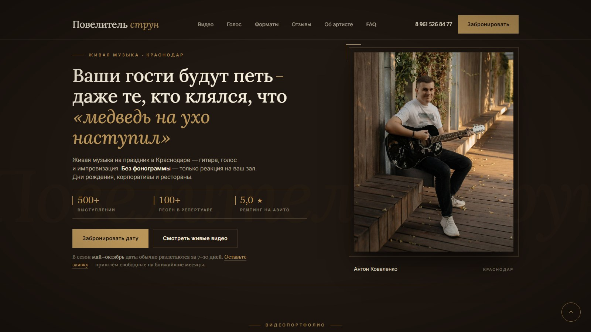
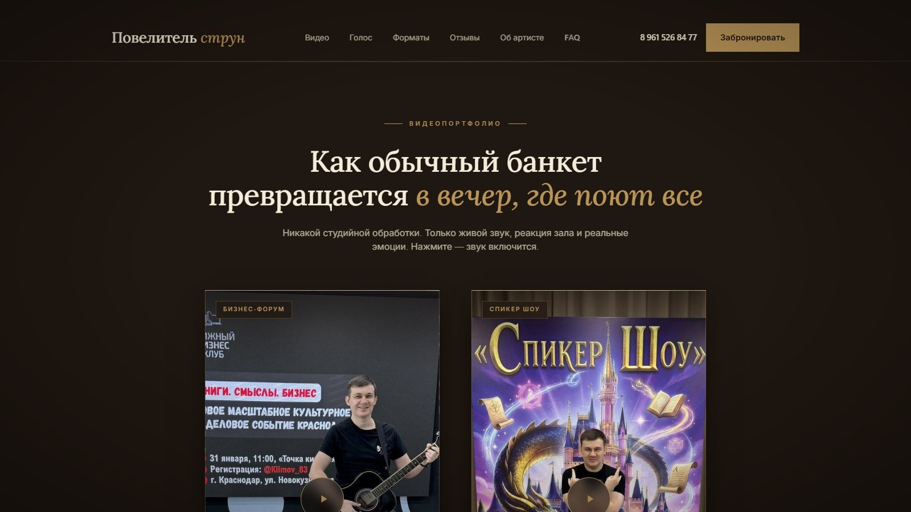
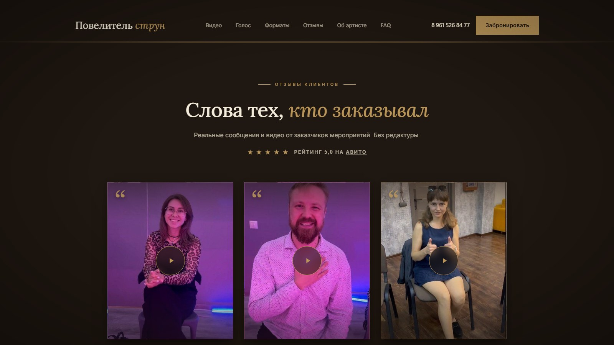
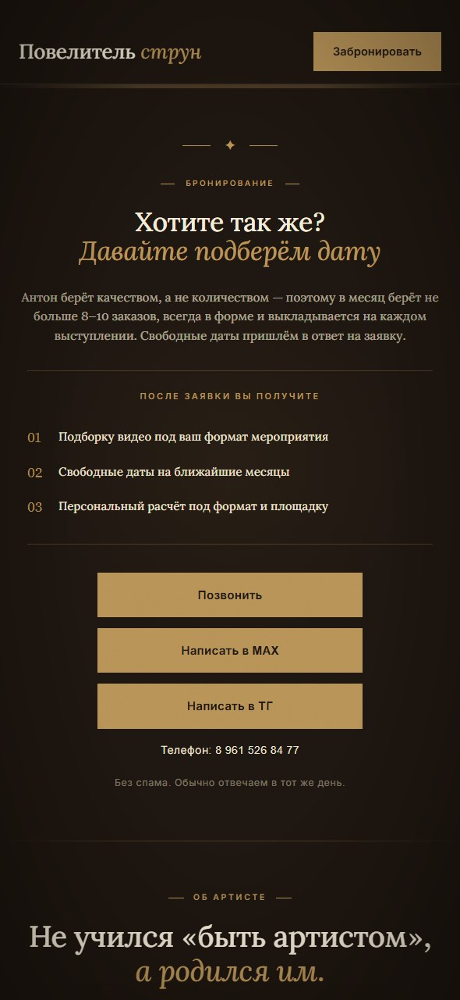

# Сайт «Повелитель струн»

Сайт-визитка музыканта для приёма заявок на живые выступления. Создан с помощью ИИ-инструментов.

🔗 **Живой сайт:** [povelitelstrun.ru](https://povelitelstrun.ru)

## Что это

Одностраничный сайт гитариста-вокалиста Антона Коваленко (Краснодар): живая музыка на дни рождения, корпоративы, свадьбы и нетворкинги. Задача сайта — показать выступления, собрать доверие через отзывы и привести к бронированию.

Сверстан вручную (HTML/CSS/JS, без конструктора и без фреймворков), оптимизирован под поиск Яндекса и быструю загрузку.

## Возможности

**Контент и разделы**

- 🎬 **Hero с анимированной статистикой** — число выступлений и рейтинг
- 🎥 **Видео выступлений** — встроены через RuTube (работают без VPN, индексируются Яндексом)
- 🎭 **Форматы выступлений** — под разные события: день рождения, корпоратив, свадьба, нетворкинг
- 💬 **Отзывы** — видеоотзывы + скриншоты реальных переписок из Telegram
- 🙋 **Об артисте, FAQ и блок бронирования**

**Интерактив и анимации**

- ✨ **Плавное появление секций** при прокрутке (scroll reveal)
- 🔢 **Счётчики цифр** накручиваются от нуля при появлении
- ⚡ **Ленивая загрузка видео** — плеер подгружается только по клику, страница открывается быстро
- ❓ **FAQ-аккордеон** — ответы раскрываются по клику

**Доступность и качество**

- ♿ **Уважает «уменьшить движение»** — при системной настройке анимации отключаются (prefers-reduced-motion)
- 🏷️ **aria-метки и alt-тексты** — корректно для скринридеров
- 📱 **Адаптивная вёрстка** — телефон и десктоп
- 🖼️ **Картинки с размерами + lazy load** — быстрая загрузка без «прыжков» страницы

## Навигация

Продумана так, чтобы посетитель быстро дошёл до брони:

- 🧭 **Фиксированное меню** — шапка остаётся на виду при прокрутке, бронь всегда под рукой
- 🔗 **Быстрые переходы по разделам** — Видео · Форматы · Отзывы · Об артисте · FAQ
- ✨ **Плавная прокрутка** к разделам по клику (smooth scroll)
- 📩 **«Забронировать» всегда в шапке** — призыв к действию не теряется при скролле
- 🔝 **Кнопка «Наверх»** — появляется при прокрутке вниз

## Демонстрация

**1. Главный экран**



**2. Видео выступлений**



**3. Видеоотзывы клиентов**



**4. Мобильная версия**



## Структура проекта

```
deploy/
  index.html        — страница целиком
  style.css         — стили
  script.js         — кнопка «Наверх», ленивая загрузка видео RuTube
  robots.txt        — правила для поисковых роботов
  sitemap.xml       — карта сайта
  favicon.*         — иконки сайта
  images/           — фото и превью видео
```

## SEO и аналитика

| Что | Статус |
|-----|--------|
| HTTPS / SSL | ✅ |
| Title, meta description | ✅ |
| Open Graph (превью в соцсетях) | ✅ |
| Schema.org (рейтинг, отзывы, FAQ, гео, услуги) | ✅ |
| robots.txt и sitemap.xml | ✅ |
| Яндекс.Вебмастер + Метрика | ✅ |
| Google Search Console | ✅ |

## Технологии

- HTML / CSS / JavaScript (vanilla, без фреймворков)
- Schema.org (JSON-LD)
- RuTube (встроенные видео)
- Яндекс.Метрика
- Хостинг: Beget
- Создано с помощью Claude Code
